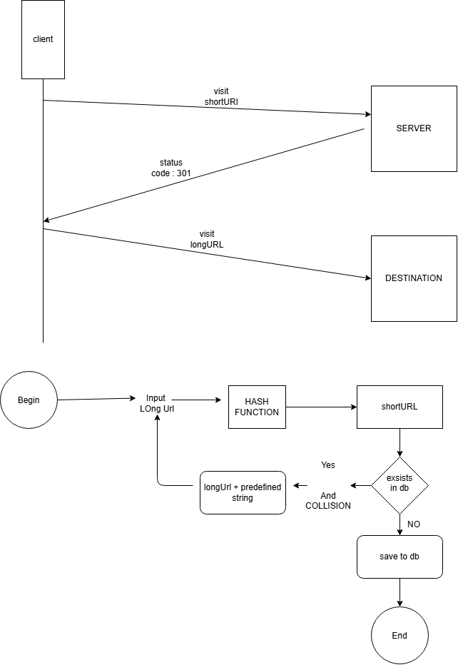

# Scalable URL Shortener Service

A production-grade, high-performance **URL Shortener API** built with Node.js, Express, Sequelize ORM, MySQL, and Redis. It utilizes **Base62 encoding** with 48-bit cryptographically secure random numbers for collision-resistant short-code generation, paired with a **Redis read-aside caching architecture** to deliver sub-millisecond redirect lookups.

---

## 📐 System Architecture



---

## ✨ Features

- ⚡ **High-Performance Lookups**: Dual-layer architecture combining **Redis Read-Aside Caching** with **MySQL Database** persistence.
- 🔢 **Collision-Resistant Short Codes**: Base62 encoding powered by `BigInt` arithmetic and `crypto.randomBytes(6)`.
- 📊 **Real-Time Click Analytics**: Tracks total redirection clicks per short code.
- ⏳ **Custom Expiration (TTL)**: Support for configurable link expiration (default: 30 days).
- 🛡️ **Request Validation & Error Handling**: Input validation middleware and centralized global error handling.
- 📝 **Structured Logging**: Low-overhead logging using **Pino** (outputs pretty logs to console and `app.log`).

---

## 🛠️ Technology Stack

- **Runtime**: Node.js (CommonJS)
- **Framework**: Express.js
- **Database**: MySQL 8.x + Sequelize ORM
- **Cache**: Redis 6+ / Memurai (RESP2 protocol compatible)
- **Logger**: Pino & Pino-Pretty
- **Utilities**: `crypto`, `http-status-codes`, `dotenv`

---

## 📂 Project Structure

```text
URL_SHORTNER/
├── src/
│   ├── config/             # Server, Database, Redis & Logger Configurations
│   │   ├── server.config.js
│   │   ├── redis.config.js
│   │   ├── logger.config.js
│   │   └── index.js
│   ├── controller/         # Request handling & HTTP response formatting
│   │   ├── urlController.js
│   │   └── index.js
│   ├── errors/             # Custom ErrorHandler class
│   │   ├── errorHandler.error.js
│   │   └── index.js
│   ├── middlewares/        # URL Validation & Global Error Handler
│   │   ├── url.middleware.js
│   │   ├── error.middleware.js
│   │   └── index.js
│   ├── migrations/         # Sequelize DB Migrations
│   │   └── 20260730043826-create-url-mapping.js
│   ├── models/             # Sequelize Data Models
│   │   ├── urlmapping.js
│   │   └── index.js
│   ├── repositories/       # Generic Base Operations & Specialized Repositories
│   │   ├── operations.repositories.js
│   │   └── url.repositreies.js
│   ├── routes/             # Express API & Redirect Routers
│   │   ├── v1/
│   │   │   ├── shortner.js
│   │   │   └── index.js
│   │   └── index.js
│   ├── services/           # Core Business Logic (Base62, Redis Caching, DB sync)
│   │   └── url_Shortner.service.js
│   ├── utils/              # Base62 encoding/decoding utilities
│   │   └── utilitiies.js
│   └── index.js            # Main Express Server Entrypoint
├── .env                    # Environment variables configuration
├── package.json            # Scripts & dependencies
└── README.md               # Project documentation
```

---

## 🚀 Getting Started

### Prerequisites

Ensure you have the following installed on your machine:
- **Node.js**: `v18.x` or later
- **MySQL Server**: `v8.0+`
- **Redis Server** / **Memurai** (listening on `localhost:6379`)

---

### Installation

1. **Clone the Repository**:
   ```bash
   git clone https://github.com/IamAbhinav01/URL_SHORTNER.git
   cd URL_SHORTNER
   ```

2. **Install Dependencies**:
   ```bash
   npm install
   ```

3. **Configure Environment Variables**:
   Create a `.env` file in the root directory:
   ```env
   PORT=3000
   logger_level=debug
   BASE62_ALPHABET=0123456789abcdefghijklmnopqrstuvwxyzABCDEFGHIJKLMNOPQRSTUVWXYZ
   REDIS_URL=redis://localhost:6379
   BASE_URL=http://localhost:3000
   ```

4. **Database Configuration**:
   Update `src/config/config.json` with your MySQL credentials:
   ```json
   {
     "development": {
       "username": "root",
       "password": "your_mysql_password",
       "database": "url_shortner",
       "host": "127.0.0.1",
       "dialect": "mysql"
     }
   }
   ```

5. **Run Migrations**:
   ```bash
   npx sequelize-cli db:create
   npx sequelize-cli db:migrate
   ```

---

### Running the Application

- **Development Mode** (with auto-reload):
  ```bash
  npm run dev
  ```

- **Production Mode**:
  ```bash
  npm start
  ```

---

## 📡 API Endpoints

### 1. Health Check
Checks if the server is up and running.

- **URL**: `GET /health`
- **Response**: `200 OK`
```json
{
  "status": "OK",
  "timestamp": "2026-07-30T18:21:37.589Z"
}
```

---

### 2. Shorten URL
Generates a short URL code for a given long URL.

- **URL**: `POST /api/v1/shortner`
- **Headers**: `Content-Type: application/json`
- **Request Body**:
```json
{
  "originalUrl": "https://github.com/IamAbhinav01/URL_SHORTNER",
  "ttlDays": 30
}
```
- **Response**: `201 Created`
```json
{
  "success": true,
  "message": "URL shortened successfully",
  "data": {
    "shortCode": "5OCMOF",
    "shortUrl": "http://localhost:3000/5OCMOF",
    "originalUrl": "https://github.com/IamAbhinav01/URL_SHORTNER"
  },
  "error": {}
}
```

---

### 3. Redirect to Original URL
Resolves the short code and redirects the client to the destination.

- **URL**: `GET /:shortCode`
- **Response**: `302 Found` (Redirects to destination URL)

---

### 4. Get Link Analytics
Retrieves analytics and click statistics for a short code.

- **URL**: `GET /api/v1/shortner/analytics/:shortCode`
- **Response**: `200 OK`
```json
{
  "success": true,
  "message": "Analytics retrieved successfully",
  "data": {
    "shortCode": "5OCMOF",
    "originalUrl": "https://github.com/IamAbhinav01/URL_SHORTNER",
    "clickCount": 1,
    "expiresAt": "2026-08-29T18:21:37.000Z",
    "createdAt": "2026-07-30T18:21:37.000Z"
  },
  "error": {}
}
```

---

## 🧪 Testing with cURL

```bash
# 1. Shorten URL
curl -X POST http://localhost:3000/api/v1/shortner \
  -H "Content-Type: application/json" \
  -d "{\"originalUrl\": \"https://example.com/very-long-url\"}"

# 2. Redirect
curl -i http://localhost:3000/<SHORT_CODE>

# 3. View Analytics
curl http://localhost:3000/api/v1/shortner/analytics/<SHORT_CODE>
```

---

## 📜 License

Distributed under the ISC License.
